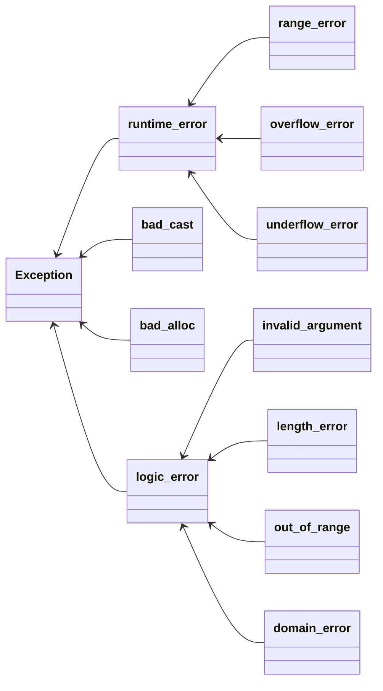

# 写在前面

简单总结一下C++异常处理部分(Exception).


# 异常处理

## 特点

1.   异常处理的流程完全独立
2.   异常不能被忽略, 必须被处理
3.   异常可以用在错误码无法使用的场合中

## 错误类型的继承关系

>   总结自CPP Primer第五版



## 判断什么时候使用异常

1.   不允许被忽略的错误
2.   极少数情况下才会发生的错误
3.   严重影响代码的正常运行流程, 很难恢复到正常状态的错误
4.   无法本地处理. 必须穿透"调用栈", 传递到上层才能被处理的错误.

例子:

-   构造函数, 内部初始化失败, 则后面的逻辑也无法进行, 这时候可以用异常处理. 
-   读写文件, 使用异常判断文件权限问题的错误
-   socket编程, 不要使用异常(因为经常出现网络问题, 使用异常降低性能)

# 代码示例

## 继承runtime_error

```cpp
class my_exception : public std::runtime_error {
public:
    using this_type = my_exception;
    using super_type = std::runtime_error;

public:
    my_exception(const char* msg) : super_type(msg) {}
    /* my_exception() = default; */
    ~my_exception() = default;

private:
    int code = 0;
};
```


## 封装throw

```cpp
[[noreturn]] void raise(const char* msg) { throw my_exception(msg); }
```


## catch语句块

>   异常只能按照catch块在代码中的 顺序依次匹配, 而不是去找最佳匹配

建议: 只使用一个catch块, 例如:

```cpp
try {
    raise("error occuerd");
} catch (const exception& e) {
    cout << e.what() << endl; // what()是exception类的虚函数
}
```


## function-try

```cpp
void fun()
    try {
        ...
    } catch (...) {
        ...
    }
```

仍然用上面的例子:

```cpp
void t2() try { raise("error occuerd"); } catch (const exception& e) {
    cout << e.what() << endl;
}
```

优点: 

1.   捕获函数执行过程中所有可能的异常
2.   少了一层缩进, 逻辑清晰


## 使用noexcept

这个关键字专门用来修饰函数, 用来告诉编译器被修饰的函数不会抛出异常.

```cpp
void func_noexcept() noexcept { cout << "noexcept\n"; }
```

只是一个声明, 就算函数体内部抛出了异常, 也是可以的. 

```cpp
void func_noexcept() noexcept {
    cout << "noexcept\n";
    throw(1);
}
// output:
//terminate called after throwing an instance of 'int'
```


# 空指针异常


